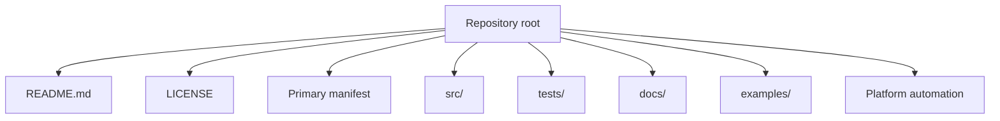
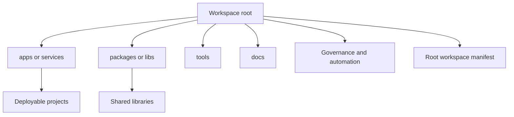

# Repository File and Directory Best Practices

## Executive Summary

A repository layout is not merely cosmetic. It is a contract between maintainers, contributors, build tools, test runners, package managers, CI/CD systems, security tooling, and downstream users. The strongest general rule is this: keep the repository root thin, put files where the platform or ecosystem already expects them, and only introduce extra top-level directories when they encode a real architectural boundary rather than personal preference. That principle is reinforced by GitHub’s repository and community-health guidance, GitLab’s required CI entrypoints and `.gitlab/` conventions, Maven and Gradle’s convention-over-configuration approach, Cargo’s file-placement conventions, Go’s module/package guidance, and the Python packaging guidance around `pyproject.toml` and `src` layout. citeturn36view0turn36view1turn37view1turn35view0turn35view3turn7search1turn31view0turn17search5turn0search5

For maintainers and contributors, the most defensible “universal default” is: a visible `README`, an explicit `LICENSE`, contributor/governance files in surfaced platform locations, source and tests separated into predictable paths, docs in `docs/`, runnable usage samples in `examples/`, automation in platform-native places like `.github/workflows` or root `.gitlab-ci.yml`, and strict segregation of secrets, generated artifacts, large binaries, and vendored third-party code. Where an ecosystem has a strong standard, follow it instead of inventing your own: `src/main/java` and `src/test/java` for Maven/Gradle; `src/lib.rs`, `src/main.rs`, `examples/`, and `tests/` for Rust; `go.mod`, package directories, `internal/`, and optionally `cmd/` for Go; `pyproject.toml` plus `src/` and `tests/` for modern Python; and `package.json` plus workspace manifests for Node/JS monorepos. citeturn36view0turn36view2turn38view0turn37view1turn35view0turn35view4turn31view2turn31view3turn31view0turn17search1turn17search0turn18search6turn9search2turn9search3

The practical recommendations that follow assume maintainers and contributors as the primary audience, no fixed repository-size constraint, and no preselected license. Because the license is unspecified, one best practice becomes non-negotiable: add an explicit `LICENSE` file early, since major packaging and hosting guidance treats explicit licensing as part of minimal repository hygiene and legal clarity. citeturn36view0turn26search3turn30search6turn12search2

- Prefer a **thin root**: only top-level files and directories that most humans and tools need immediately. citeturn36view0turn35view0turn7search1turn31view0
- Use **platform-native automation locations**: `.github/workflows` for GitHub Actions; root `.gitlab-ci.yml` for GitLab; optional helper YAML in `ci/` only as included fragments, never as the primary entrypoint. citeturn38view0turn38view1turn37view1
- Follow **ecosystem conventions before personal taste**: Maven/Gradle and Cargo are highly opinionated; Go and Python are moderately opinionated; Node is more flexible but still manifest-driven. citeturn35view0turn35view4turn31view2turn31view0turn17search5turn18search6
- Separate **human-authored source** from **tests**, **docs**, **examples**, **generated outputs**, **large assets**, and **vendored dependencies**. citeturn17search0turn7search9turn10search0turn10search7turn16view2
- In monorepos, separate **deployables** from **shared packages/libraries**, centralize workspace metadata, and enforce module boundaries in CI. citeturn21view0turn31view3turn31view4turn22view0
- Reorganize legacy repositories **incrementally**, with tests, branch protection, CODEOWNERS, and compatibility shims before removing old paths. citeturn19search18turn36view3turn17search5turn29search12turn21view0

## Design Goals of Repository Layout

A well-designed layout improves discoverability because hosting platforms actively surface certain files. GitHub renders the `README` on the repository front page and explicitly recommends a README for every repository; it also surfaces `CONTRIBUTING`, code-of-conduct, and other community-health files in the repository UI and community profile. That means directory structure is not only a filesystem choice but also a documentation and onboarding surface. citeturn27search9turn10search20turn36view0turn36view1turn36view2

Modularity and testability improve when the layout mirrors architectural boundaries rather than obscuring them. Maven’s standard layout separates production sources, resources, tests, integration-test sources, and site content; Gradle inherits similar defaults and explicitly recommends standard conventions and separate source sets for different test types; Cargo auto-discovers library, binary, example, test, and benchmark targets from directory layout; pytest’s guidance for new projects favors layouts that prevent accidental imports from the working tree and distinguishes tests from import packages. citeturn35view0turn35view4turn35view3turn7search21turn7search9turn17search0turn0search5

CI/CD and release engineering work best when layout is tool-addressable. GitHub Actions only recognizes workflow files defined as YAML workflows and stored under `.github/workflows`; reusable workflows must also live there, and subdirectories under `workflows` are not supported. GitLab, by contrast, uses a root `.gitlab-ci.yml` as the entrypoint, with `include` available to split configuration into local or external fragments. Monorepo tools such as npm, pnpm, Yarn, Cargo, Gradle, Nx, and Bazel similarly rely on root workspace/build metadata to discover projects, dependencies, and task graphs. citeturn38view0turn38view1turn37view1turn9search2turn9search3turn31view3turn31view4turn21view0turn22view0

Security and licensing are also layout concerns. GitHub’s repository best-practices page recommends enabling security features such as Dependabot alerts, secret scanning, push protection, and code scanning, and also recommends adding `SECURITY.md`. GitHub and GitLab both provide structured mechanisms for secret handling outside the repository tree, while packaging guidance across ecosystems assumes an explicit license file and often dedicated metadata fields for license expressions or files. citeturn36view0turn27search0turn11search7turn11search12turn11search0turn37view2turn11search6turn17search1turn17search18turn12search1

| Goal | Layout implication | Why it matters | Authoritative basis |
|---|---|---|---|
| Discoverability | Keep `README`, `LICENSE`, and contributor-health files in surfaced locations. | Platforms display and link these files directly, reducing search cost for contributors and users. | GitHub README and community-health guidance. citeturn36view0turn36view1turn36view2 |
| Modularity | Put source, tests, examples, and docs in separate, named subtrees. | Conventional separation gives tools stable defaults and signals architecture to humans. | Maven, Gradle, Cargo, pytest. citeturn35view0turn35view3turn7search9turn17search0 |
| CI/CD | Use platform-native workflow/config locations. | Tooling will only discover workflows/configuration in specific paths. | GitHub Actions, GitLab CI. citeturn38view0turn38view1turn37view1 |
| Security | Keep secrets out of Git, protect workflow and sensitive paths, add `SECURITY` guidance. | Secret leakage and unsafe workflow edits are operational risks, not style issues. | GitHub secret security and CODEOWNERS; GitLab CI variable guidance. citeturn11search0turn11search12turn11search3turn19search8turn37view2turn36view3 |
| Licensing | Add an explicit `LICENSE` early; keep third-party notices separable. | Explicit licensing and attribution are prerequisites for reliable reuse and distribution. | GitHub licensing; PyPA; Maven `LICENSE.txt`/`NOTICE.txt`; SPDX. citeturn26search3turn30search6turn35view0turn12search1 |

## Universal Top-Level Conventions

Across official platform docs and successful large OSS repositories, a strong pattern emerges: the repository root should contain identity, policy, the primary manifest(s), and only a small number of stable subtrees. Django’s root exposes docs, license, contributing guide, package metadata, and test tooling; React’s root exposes `.github`, `packages`, `fixtures`, `scripts`, and major health files; GitHub CLI’s root exposes `.github`, `cmd`, `internal`, `docs`, `build`, `test`, and Go manifests; Kubernetes exposes a large but still legible top level with `cmd`, `docs`, `hack`, `pkg`, `staging`, `test`, `third_party`, and `vendor`; and Turborepo exposes `apps`, `packages`, `crates`, `examples`, and workspace manifests. The common theme is not identical names; it is predictable intent. citeturn15view0turn16view0turn16view3turn16view2turn16view1

That pattern supports a practical universal baseline. Files that explain the project or govern collaboration belong at top level or in platform-supported health-file locations. Directories belong at top level only when they represent first-class concerns such as source, tests, docs, examples, automation, or clearly bounded subsystems. Everything else should usually be nested under one of those stable umbrellas rather than added ad hoc to the root. citeturn36view0turn36view1turn36view2turn35view0turn7search1

| Item | Universal recommendation | Placement rule or caveat | Evidence |
|---|---|---|---|
| `README.md` | Include in every repository. | Root is the default and is rendered on the repository front page. | GitHub recommends a README for every repo and renders it prominently. citeturn36view0turn27search9turn10search20 |
| `LICENSE` or `LICENSE.md` | Include explicitly unless the repository is intentionally private/internal and non-distributed. | GitHub guidance uses all-caps `LICENSE`/`LICENSE.md`; packaging guidance assumes explicit licensing. | citeturn26search3turn30search6turn17search11 |
| `CONTRIBUTING.md` | Include when outside contributions or internal multi-author collaboration are expected. | GitHub checks `.github`, then root, then `docs`; links are surfaced in UI. | citeturn36view2turn36view1 |
| `CODE_OF_CONDUCT.md` | Include for public or community-facing projects. | GitHub default health files can centralize it in a `.github` repo. | citeturn36view1turn27search17 |
| `SECURITY.md` | Strongly recommended for any project with external users or dependencies. | Use surfaced locations on GitHub; keep reporting instructions current. | citeturn36view0turn27search0 |
| `.gitignore` | Keep at root and commit it. | Share ignore rules with all cloners; use platform templates as a starting point. | citeturn20search3turn20search1 |
| `.gitattributes` | Use when you need LFS, generated-file marking, diff tuning, or linguist settings. | Root file is standard; often paired with Git LFS or generated-code classification. | citeturn10search4turn10search7turn20search8 |
| `docs/` | Use for narrative docs beyond the README. | Also a supported location for GitHub community files and CODEOWNERS, but do not scatter governance files there unless intentional. | citeturn36view1turn36view2turn36view3turn15view0 |
| `src/` | Prefer for languages/ecosystems that benefit from explicit source roots. | Strongly standard in Maven/Gradle and Cargo; recommended in modern Python packaging; optional in Node. | citeturn35view0turn35view4turn7search1turn17search5turn0search5 |
| `tests/` | Use for integration/black-box tests or as the main test subtree when the ecosystem expects it. | Rust and pytest both recognize `tests/`; JVM builds often use `src/test/*` instead. | citeturn7search9turn17search0turn35view0 |
| `examples/` | Use for runnable examples, not long-form docs. | Cargo auto-discovers `examples/`; examples are distinct from tutorials in docs. | citeturn7search21turn31view2turn15view4 |
| `scripts/` | Use for repo-local operational helpers. | Good for portable developer/CI entrypoints; do not hide core build metadata there. | Seen in React and Turborepo roots. citeturn16view0turn16view1 |
| `build/` | Reserve for generated build output or build-related support files. | Dangerous as a permanent source directory because Gradle uses `build/` as its default output; Maven uses `target/`; Cargo uses `target/`. | citeturn35view3turn35view4turn35view0turn31view3 |
| `ci/` | Optional support directory only. | Useful for included GitLab YAML fragments or custom CI scripts, but not as the primary GitHub/GitLab workflow location. | GitLab supports includes from other files; GitHub requires `.github/workflows`. citeturn37view1turn38view0turn38view1 |
| `.github/` | Use for GitHub-native repository metadata and automation. | Best home for workflows, Dependabot config, issue templates, and optionally health files/CODEOWNERS. | citeturn38view0turn38view1turn38view2turn36view4turn36view3turn36view1 |
| `.gitlab/` | Use for GitLab-native repository metadata and templates. | Holds description templates, CODEOWNERS, agents, route maps, and security rulesets. | citeturn37view0turn37view3turn37view4 |
| `assets/` | Use for source design/media assets that belong to the repository. | Large binary assets should generally go through Git LFS; avoid mixing source assets with compiled output. | Inference from GitHub non-code and LFS guidance. citeturn10search0turn27search8turn26search5 |
| `tools/` | Use for repo-local generators, helper CLIs, or development tooling. | Keep it distinct from `scripts/` when the contents are reusable programs rather than one-off shell helpers. | Common in large OSS layouts; separation is a synthesis from repository examples. citeturn16view1turn16view2turn16view3 |
| `third_party/` or `vendor/` | Use only when shipping vendored dependencies, upstream mirrors, or legally required third-party material. | Keep clearly segregated from first-party code; keep license/notice handling explicit. | Kubernetes uses both `third_party` and `vendor`; Go tooling supports vendoring; Maven documents `NOTICE.txt`. citeturn16view2turn32search8turn35view0 |

GitHub-specific file placement is opinionated enough that ignoring it creates hidden friction. Community-health files are resolved in `.github`, then root, then `docs`; `CONTRIBUTING` follows the same precedence; `CODEOWNERS` is recognized in `.github`, root, or `docs`; issue forms must live in `.github/ISSUE_TEMPLATE`; pull request templates can live in root, `docs`, or `.github`, with a `PULL_REQUEST_TEMPLATE` subdirectory for multiple templates; workflows and reusable workflows must live under `.github/workflows`; and Dependabot configuration must live at `.github/dependabot.yml` or `.yaml` on the default branch. citeturn36view1turn36view2turn36view3turn38view2turn38view3turn38view0turn38view1turn36view4

GitLab is similarly opinionated, but with different entrypoints. The pipeline entry file is root `.gitlab-ci.yml`; local includes are allowed to decompose that file into a library of YAML fragments; the `.gitlab/` directory hosts issue templates, merge request templates, `CODEOWNERS`, and several GitLab-native configuration files; and description templates must be `.md` files stored in `.gitlab/issue_templates` or `.gitlab/merge_request_templates` on the default branch. citeturn37view1turn37view0turn37view3turn37view4

## Language and Ecosystem Variations

The most robust universal practice is not “one layout for every repository”; it is “strong standards where the ecosystem provides them, mild standards elsewhere.” Maven, Gradle, and Cargo reward convention strongly. Go specifies modules, packages, `internal/`, and `cmd/` patterns but intentionally allows simpler shapes. Python has standardized around `pyproject.toml` but still allows multiple workable trees. Node is primarily manifest-driven, with structure often set by framework or monorepo tooling rather than the runtime itself. citeturn35view0turn35view4turn7search1turn31view0turn17search5turn18search6

| Ecosystem | Root metadata and manifests | Conventional source and test layout | Practical recommendation |
|---|---|---|---|
| Python | `pyproject.toml` is the modern metadata/config base; modern packaging guidance strongly recommends adding `[build-system]`; dependency groups are specified in `pyproject.toml`; tool-specific lockfiles include `uv.lock` or `poetry.lock`. citeturn17search5turn30search22turn17search15turn23search16turn33search14 | Modern projects often prefer `src/<import_package>/` plus `tests/`; pytest explicitly recommends import practices that avoid accidental path leakage, and PyPA documents `src` vs flat layouts. citeturn17search0turn0search5 | Use `pyproject.toml`, prefer `src/` for publishable packages, keep tests outside the import package unless you have a compelling reason otherwise, and treat lockfile policy as tool- and project-type-specific rather than universal. citeturn17search5turn17search0turn33search1turn33search3 |
| JavaScript and Node | `package.json` is the root manifest; package names must be lowercase without spaces; `version` uses `x.x.x`; `"scripts"` centralizes task entrypoints; `"main"` and `"exports"` define public entrypoints; the npm publish process always includes key files like `package.json`, `README`, and `LICENSE`. citeturn30search15turn18search14turn34search17turn34search1turn34search14 | The runtime imposes little directory structure; `src/`, `test/` or `tests/`, and workspace package directories are common. Monorepos typically use npm/pnpm/Yarn workspaces. citeturn18search6turn9search2turn9search3turn21view0 | Keep `package.json` at each package root, use `exports` to define the public surface, keep developer tasks in `"scripts"`, and use workspaces when multiple packages live in one repository. citeturn34search1turn34search10turn34search17turn9search2turn9search3 |
| Java with Maven or Gradle | Maven expects `pom.xml`; Gradle expects `settings.gradle(.kts)` at the build root and `build.gradle(.kts)` per project; Gradle inherits Maven-like conventions. citeturn35view1turn31view4turn35view4 | Maven standard layout uses `src/main/java`, `src/main/resources`, `src/test/java`, `src/test/resources`, optional `src/site`, and build output in `target`; Gradle defaults to the same source layout but uses `build/` as output and supports additional source sets like `integrationTest`. citeturn35view0turn35view3turn35view4 | Do not fight the standard JVM layout unless migrating legacy code; if you need more than one module, use Maven multi-module or Gradle multi-project structure rather than inventing your own coordination layer. citeturn35view0turn35view2turn31view4 |
| Go | `go.mod` defines the module; `go.sum` records dependency checksums and should be committed; repository scope is simplest with one module at the root, though multiple modules are supported. citeturn32search8turn31view1turn32search11 | Official guidance allows simple roots for small commands, package directories for importable packages, `internal/` for non-public packages, and `cmd/` as a common convention when mixing commands with importable packages. citeturn31view0turn30search0 | Start simpler than many community templates suggest. Add `internal/` only when you need visibility boundaries, and add `cmd/` when a mixed repo would otherwise become ambiguous. Prefer one module per repo unless you truly need separately versioned submodules. citeturn31view0turn31view1 |
| Rust | `Cargo.toml` is the manifest; packages can infer library, binary, example, test, and benchmark targets by layout; workspaces are defined in a root `Cargo.toml`. citeturn7search1turn7search21turn31view3 | Standard layout uses `src/lib.rs`, `src/main.rs`, `src/bin/`, `examples/`, `tests/`, and `benches/`; targets conventionally use `kebab-case`, modules use `snake_case`; workspaces share a root `Cargo.lock` and `target/`. citeturn7search1turn31view2turn31view3 | Follow Cargo’s defaults very closely. Cargo already gives you a discoverable, tool-friendly structure; deviations usually add complexity rather than value. citeturn7search1turn31view3 |
| Monorepos and microservices | Root workspace metadata varies by tool: npm/Yarn workspaces in `package.json`, `pnpm-workspace.yaml` for pnpm, `[workspace]` in root `Cargo.toml`, `settings.gradle(.kts)` for Gradle, `nx.json` for Nx, and a Bazel workspace plus `BUILD` files for Bazel. citeturn9search2turn9search3turn31view3turn31view4turn21view0turn22view0 | Common conventions separate deployables (`apps/` or `services/`) from shared libraries (`packages/` or `libs/`). Nx explicitly documents `apps/` + `packages/` as a common convention, and Gradle shows nested service/shared subprojects as normal. citeturn21view0turn31view4 | Use one top-level namespace for deployables and one for shared code, centralize workspace metadata at root, and avoid path aliases or cross-import habits that bypass the workspace/build graph. citeturn21view0turn31view3turn22view0 |

Two ecosystem distinctions matter more than people often admit. First, Maven/Gradle and Cargo are **layout-convention-heavy**: your directory tree is part of how the build works. Second, Go and Python are **API-boundary heavy**: the official docs focus more on modules, packages, and visibility than on forcing one exact tree. That means “universal best practice” should be strongest around the root and around boundary-bearing directories, not around cosmetic subfolder choices inside every package. citeturn35view0turn35view4turn7search1turn31view0turn17search5

For monorepos and microservice-heavy repositories, a good universal pattern is to separate deployable artifacts from reusable code explicitly. `apps/` or `services/` should hold independently built or deployed units; `packages/` or `libs/` should hold shared code; `tools/` should hold repo-local generators and helper CLIs; and root manifests should define the workspace or build graph. Nx documents this clearly for JS/TS workspaces, Cargo does the same via workspace members, and Gradle’s multi-project layout shows the same underlying principle in JVM terms. citeturn21view0turn31view3turn31view4

## Naming, Placement, Versioning, Dependencies, and Sensitive Material

Naming should optimize for stability and obviousness, not cleverness. npm package names must be lowercase without spaces and are expected to be descriptive; Go package names are conventionally short, lower-case, and single-word; Cargo documents `kebab-case` target names and `snake_case` module names; Python packaging distinguishes between normalized distribution names and import-package names, so repository naming and import paths should not be conflated casually. At the directory level, the universal rule is consistency: pick `apps/` or `services/`, `packages/` or `libs/`, and singular or plural forms once, then keep them stable across the repo. citeturn30search15turn30search1turn30search0turn31view2turn30search10turn30search2

File placement should follow the distinction between **what users must read first**, **what tools must discover automatically**, and **what developers touch during implementation**. Human-first files belong at the root or at surfaced platform locations; tool-first files belong where the platform requires them; implementation files should live under source/test/docs/examples subtrees. This is why a top-level `ci/` may be useful for included YAML or helper scripts, but should not replace `.github/workflows` or root `.gitlab-ci.yml`; and why `build/` is a poor place for hand-maintained source in Gradle- or JVM-adjacent repositories, since it already has a conventional generated meaning. citeturn38view0turn38view1turn37view1turn35view3turn35view4

Versioning should be explicit and tool-native. Semantic Versioning is the most widely portable default when you have a documented public API. npm explicitly recommends SemVer-style versioning in `package.json`; Cargo bakes SemVer compatibility into its dependency semantics; Go module version numbering uses semantic import versioning, where incompatible major versions require a path suffix for `v2+`; Python metadata uses PEP 440-compatible version specifiers rather than raw SemVer syntax. The practical consequence is simple: use one visible source of truth for the project version, but express it in the format your ecosystem actually resolves. citeturn18search0turn18search2turn7search20turn7search2turn18search3turn18search23turn18search1turn18search5

Dependency management should be centralized but not flattened beyond recognition. Each publishable package or module should usually keep its own native manifest (`pyproject.toml`, `package.json`, `pom.xml`, `build.gradle.kts`, `go.mod`, `Cargo.toml`), while workspace metadata belongs at the root. Lockfiles serve different purposes across ecosystems: Go expects `go.mod` and `go.sum` in the repository; Cargo workspaces share a root `Cargo.lock`; Poetry and uv use lockfiles for repeatable development environments; Poetry explicitly notes that a library’s lockfile affects the main project, not downstream consumers; and monorepo package managers rely on a root lockfile for workspace reproducibility. Universal best practice, then, is to commit deterministic dependency state for applications and workspace roots, and to document any library-specific exception rather than leaving it implicit. citeturn32search8turn31view3turn33search1turn33search3turn23search16turn32search3turn9search2turn9search3

Secrets should never be treated as ordinary files or ordinary configuration values. GitHub advises against hardcoding secrets and recommends environment variables or dedicated secret-management services; GitHub Actions secrets are stored at organization, repository, or environment scope and are only readable when explicitly included in a workflow; GitHub push protection blocks pushes containing supported secrets; GitLab warns that variables saved in `.gitlab-ci.yml` are visible to anyone with repository access and says sensitive values should be stored in the UI or via external secrets. For repository structure, that translates into a hard rule: no plaintext credentials in source, no checked-in `.env` production secrets, and no sensitive values embedded in workflow files. citeturn11search3turn11search7turn11search0turn11search12turn37view2turn11search6

Large files and generated artifacts should be segregated aggressively. GitHub recommends Git LFS for large files, recommends committing the corresponding `.gitattributes`, and documents repository/object size constraints; it also lets you mark generated files with the `linguist-generated` attribute in `.gitattributes` so diffs and language statistics treat them appropriately. A universal practice follows from that: keep generated output out of normal Git whenever you can, and when you cannot, isolate it in a clearly named subtree and tag it as generated. Large OSS repositories reinforce this approach: Kubernetes explicitly separates generated-file management and also isolates `third_party` and `vendor`. citeturn10search0turn10search4turn27search8turn10search7turn16view2

Vendored or third-party code deserves an explicit boundary because it changes legal, security, and upgrade workflows. Go tooling supports vendoring; Maven’s standard layout explicitly documents project `LICENSE.txt` and `NOTICE.txt`; Python packaging supports explicit license-file inclusion patterns; and repositories such as Kubernetes visibly segregate `third_party` and `vendor`. The universal recommendation is to vendor only when you need hermeticity, patching control, or distribution/legal reasons, and to keep third-party trees separate from first-party trees both physically and in ownership/review policy. citeturn32search8turn35view0turn17search1turn16view2turn36view3

## Starter Layout Templates

The following starter layouts are deliberately minimal. They represent the smallest layouts that still preserve readability, contributor onboarding, testability, and automation. They are not language-locked, but each is aligned with official platform expectations and can be adapted to ecosystem-specific manifests and source conventions. citeturn36view0turn38view0turn37view1turn17search5turn31view0turn7search1

| Project type | Recommended top-level shape | When it fits best | Notes |
|---|---|---|---|
| Small library | `README`, `LICENSE`, primary manifest, `.gitignore`, `src/`, `tests/`, `docs/`, `examples/`, automation directory/file | Reusable package/crate/module with public API | Best default for Python, Rust, and many JS libraries; Maven/Gradle libraries map the same idea into `src/main/*` and `src/test/*`. citeturn17search5turn17search0turn7search1turn35view0turn35view4 |
| CLI tool | `README`, `LICENSE`, manifest, source tree (`src/` or `cmd/`), `tests/`, `docs/`, `scripts/`, release workflow | Executables installed and run directly by users or CI | Go officially documents simple command roots and `cmd/` as a common convention in mixed repos; Rust uses `src/main.rs` or `src/bin/`. citeturn31view0turn7search1turn16view3 |
| Web app | `README`, `LICENSE`, manifest, `src/`, static assets (`public/` or `assets/`), `tests/`, `docs/`, deployment automation | Single deployable web service or frontend/back-end repo | JVM web apps may use `src/main/webapp`; JS frameworks vary widely, so keep the root disciplined and let the framework dictate the internal app tree. citeturn35view0turn18search6turn36view0 |
| Monorepo | `README`, `LICENSE`, workspace/build metadata, `apps/` or `services/`, `packages/` or `libs/`, `tools/`, `docs/`, platform automation | Multiple deployables and shared code managed in one VCS root | Matches Nx, pnpm, Yarn, Cargo workspaces, Gradle multi-project, and many large OSS repos. citeturn21view0turn9search2turn9search3turn31view3turn31view4turn16view1 |

A typical small library default can be visualized as a human-first root wrapped around a few stable subtrees. This pattern is directly compatible with GitHub’s surfaced files, PyPA’s `src` guidance, Cargo’s package layout, and the broad separation of source/tests/docs/examples used across mature OSS projects. citeturn36view0turn17search0turn0search5turn7search1turn15view0turn16view0



A typical monorepo default should make deployables and shared code visually distinct, with root metadata defining the project graph. That is the logic behind Nx’s `apps/` and `packages/`, Cargo workspace members, Gradle subprojects, and Bazel workspaces with per-package build definitions. citeturn21view0turn31view3turn31view4turn22view0



A minimal small-library template should look like this in generic form. For Python, the manifest is typically `pyproject.toml`; for Rust, `Cargo.toml`; for many JS libraries, `package.json`; and for JVM libraries, the internal source layout would become `src/main/java` and `src/test/java` rather than a single `src/` subtree. citeturn17search5turn7search1turn18search6turn35view0turn35view4

```text
small-library/
  README.md
  LICENSE
  CONTRIBUTING.md
  .gitignore
  <primary-manifest>
  src/
    <library_name>/
  tests/
  docs/
  examples/
  .github/
    workflows/
      ci.yml
```

A minimal CLI template should expose the executable clearly and keep release logic visible. In Go, `cmd/<tool>/main.go` becomes more attractive as soon as the repo also exports packages; in Rust, `src/main.rs` is idiomatic for the simplest case; GitHub CLI demonstrates how larger CLI repositories grow supporting directories like `cmd`, `internal`, `docs`, `build`, and `test` without losing legibility. citeturn31view0turn7search1turn16view3

```text
cli-tool/
  README.md
  LICENSE
  .gitignore
  <primary-manifest>
  src/              # or cmd/<tool>/ for Go-style mixed repos
  tests/
  docs/
  scripts/
  .github/
    workflows/
      ci.yml
      release.yml
```

A minimal web-app template should keep source, assets, tests, and deployment automation separate. The internal app tree will vary by framework, but the top-level rule is constant: keep the root thin, keep static or source assets separate from compiled output, and keep deployment/CI explicit. citeturn35view0turn36view0turn10search0

```text
web-app/
  README.md
  LICENSE
  .gitignore
  <primary-manifest>
  src/
  assets/           # or public/ when your framework expects it
  tests/
  docs/
  scripts/
  .github/
    workflows/
      ci.yml
      deploy.yml
```

A minimal monorepo template should make dependency direction and ownership obvious. `apps/` can be replaced by `services/` in microservice-heavy repositories, and `packages/` can be replaced by `libs/`; the key is to avoid mixing both at once unless there is a real semantic difference. Root workspace metadata should be singular and authoritative. citeturn21view0turn31view3turn31view4turn9search2turn9search3

```text
monorepo/
  README.md
  LICENSE
  .gitignore
  docs/
  apps/             # or services/
    app-a/
    app-b/
  packages/         # or libs/
    shared-a/
    shared-b/
  tools/
  <root-workspace-manifest>
  .github/
    workflows/
      ci.yml
```

## Migration, Enforcement, and Maintenance

Reorganizing an existing repository is safest when treated as a compatibility migration, not a cleanup spree. Official migration guidance across ecosystems converges on the same lesson in different language: preserve behavior first, then improve structure. Python packaging guidance recommends modernizing legacy `setup.py`-based projects by adding `pyproject.toml`; Gradle explicitly documents converting single-project builds to multi-project builds; Nx supports `nx init` to add workspace intelligence to an existing repository; and Go’s module-source guidance explains why a single module at the repository root simplifies long-term versioning. citeturn17search5turn29search12turn21view0turn31view1

A good migration sequence starts with inventory and ends with deletion. Inventory files, commands, integrations, and import paths; define the target map; add or harden regression tests; move documentation and governance files first because they are operationally low-risk; then move code and manifests in slices; update CI/CD and package metadata; add compatibility shims if consumers still rely on legacy paths; and only then remove old paths. Branch protection and CODEOWNERS should be tightened during this process, not after it. citeturn19search18turn36view3turn35view2turn17search5turn29search12

A safe migration timeline can be visualized like this. It is deliberately incremental because repository consumers include far more than developers: CI jobs, release jobs, static analyzers, package indexes, container builds, docs links, and external import paths all depend on pathname stability. citeturn37view1turn38view0turn17search5turn31view1


Enforcement should combine repository policy with automated checks. GitHub’s CODEOWNERS can automatically request review for sensitive paths and can be combined with branch protection to require reviewed changes; GitHub’s secure-use guidance explicitly recommends using CODEOWNERS to monitor `.github/workflows`. GitLab’s `CODEOWNERS` serves the same high-level role for protected branches. GitLab additionally provides CI Lint for validating `.gitlab-ci.yml`, while GitHub’s workflow system only recognizes workflow definitions in the expected directory tree. These platform facts are enough to justify a small, explicit “layout check” job in CI that fails when required files are missing or when config appears in unsupported locations. citeturn36view3turn19search8turn37view3turn37view1

| Maintainer check | What CI should enforce |
|---|---|
| Root has `README` and explicit `LICENSE`. | Fail if either file is missing. citeturn36view0turn26search3 |
| Contributor and governance files exist where the platform will surface them. | Fail if `CONTRIBUTING`/`CODE_OF_CONDUCT`/`SECURITY` are absent for public-facing repos, or if duplicates create precedence surprises. citeturn36view1turn36view2turn27search0 |
| Automation lives in native locations. | Fail on GitHub if workflows are not under `.github/workflows`; fail on GitLab if root `.gitlab-ci.yml` is missing; lint GitLab CI config. citeturn38view0turn38view1turn37view1 |
| Source/test/docs/example trees are explicit. | Fail if a repo with package metadata has no recognizable source/test subtree or if generated output is mixed into source roots. citeturn35view0turn7search9turn17search0turn10search7 |
| Lockfiles and dependency manifests are consistent. | Run the native install/resolve command and fail on dirty lockfile diffs or missing checksum files such as `go.sum`. citeturn32search8turn31view3turn33search1 |
| Sensitive values are out of tree. | Enable secret scanning/push protection where available and fail on known secret patterns or committed `.env` production files. citeturn11search0turn11search12turn11search3 |
| Large files and generated files are handled intentionally. | Fail on oversized committed blobs, require Git LFS for large tracked assets, and require `.gitattributes` when generated files are committed. citeturn27search8turn10search0turn10search4turn10search7 |
| Sensitive paths have explicit reviewers. | Require `CODEOWNERS` coverage for CI config, deployment code, vendored code, and security-sensitive subtrees. citeturn36view3turn37view3 |

One migration caveat is worth separating out: if the repository has ever contained secrets or problematic large files, layout cleanup alone is not enough. GitHub’s guidance on removing sensitive data and its large-file management docs make clear that history may itself need remediation. Repository reorganization is a good time to decide whether you also need history rewriting, credential rotation, or a move to Git LFS. citeturn11search3turn10search2turn10search11

## Trade-Offs and Anti-Patterns

The central trade-off in repository design is between **uniformity** and **local fit**. Over-standardization produces layouts that satisfy a generic checklist but fight the actual build tool or framework; under-standardization produces repositories that only make sense to their original authors. The right balance is to standardize the root, the governance surface, and the project graph, while allowing ecosystem-native shapes inside individual packages or modules. That is why Maven and Cargo should usually be left alone, while Node and Python often tolerate more internal flexibility. citeturn35view0turn7search1turn18search6turn17search5

A common anti-pattern is the “junk-drawer root”: dozens of unrelated files and one-off directories with unclear ownership. Another is file-placement that looks tidy but breaks platform discovery, such as putting GitHub workflows outside `.github/workflows` or assuming GitLab will discover CI fragments without a root `.gitlab-ci.yml`. A third is hiding important contributor guidance in non-surfaced paths, which defeats the UI affordances GitHub and GitLab already provide. citeturn38view0turn38view1turn37view1turn36view2turn36view1

Another anti-pattern is treating generated output as if it were handwritten source. This inflates diffs, confuses ownership, and blurs the line between build products and maintainable code. If generated files must be committed, they should be isolated, reproducibly regenerated, and marked appropriately in `.gitattributes`. Similarly, large binary assets should not quietly accumulate in ordinary Git history when Git LFS and asset-specific handling exist. citeturn10search7turn10search0turn10search4turn27search8

Monorepos introduce their own failure modes. The most harmful one is boundary erosion: shared code starts as a clean `packages/` or `libs/` subtree but gradually becomes a dumping ground for convenience imports, circular couplings, and unowned utilities. Official monorepo tooling exists to prevent exactly that by making project discovery, dependency graphs, and package relationships explicit. If a monorepo cannot answer “what is deployable, what is shared, and who owns each subtree,” the shape is already failing. citeturn21view0turn31view3turn31view4turn22view0

The last anti-pattern is more subtle: using lockfiles, vendoring, or repo-local build logic without being explicit about scope. Poetry notes that a library lockfile affects the main project rather than downstream dependents; Go warns that multiple modules per repository complicate version tagging; GitHub and GitLab both require secrets to be managed outside ordinary tracked config for sensitive values. In other words, repository structure should state plainly what is authoritative, what is generated, what is private, and what is public API. Hiding those distinctions creates long-term maintenance debt. citeturn33search3turn31view1turn11search7turn37view2

The most broadly correct default, then, is conservative rather than elaborate: a thin root, explicit policy files, strong ecosystem conventions, stable source/test/docs boundaries, platform-native automation paths, and clear segregation for secrets, large artifacts, generated output, and third-party code. Repositories that follow that model are easier to navigate, easier to secure, easier to test, easier to automate, and easier to reorganize when they inevitably grow. citeturn36view0turn35view3turn7search1turn31view0turn10search7turn11search0